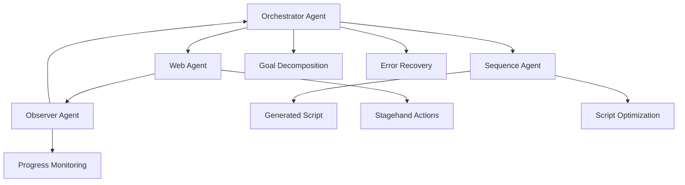

# Enhanced Multi-Agent Recording System

A sophisticated multi-agent architecture for goal-aware web automation recording using LangGraph coordination, Gemini models, and Stagehand web automation.

## 🚀 Overview

This enhanced system implements a **four-agent architecture** that coordinates to achieve complex web automation goals:

- **🎯 Orchestrator Agent** (Gemini 2.5 Pro) - Strategic planning and coordination
- **🌐 Web Agent** (Gemini 2.5 Flash + Stagehand) - Web action execution
- **👁️ Observer Agent** (Gemini 2.5 Flash) - Real-time monitoring and analysis
- **📝 Sequence Agent** (Gemini 2.5 Pro) - Optimized Playwright script generation

## 🏗️ Architecture



### Agent Responsibilities

#### 🎯 Orchestrator Agent
- **Model**: Gemini 2.5 Pro
- **Role**: Strategic coordinator and decision maker
- **Responsibilities**:
  - Parse and validate user goals
  - Break down complex goals into executable sub-tasks
  - Coordinate agent communication and handoffs
  - Implement intelligent retry strategies
  - Handle error recovery and fallback scenarios
  - Decide when to terminate recording sessions

#### 🌐 Web Agent
- **Model**: Gemini 2.5 Flash
- **Tools**: Stagehand web automation
- **Role**: Web interaction specialist
- **Responsibilities**:
  - Translate natural language instructions to Stagehand commands
  - Execute web actions (navigate, click, type, scroll, wait)
  - Log all interactions with timestamps and DOM snapshots
  - Provide context-aware decision making
  - Handle dynamic web elements and timing issues

#### 👁️ Observer Agent
- **Model**: Gemini 2.5 Flash
- **Role**: Real-time analyst and monitor
- **Responsibilities**:
  - Analyze current page state and DOM structure
  - Track progress indicators and completion signals
  - Detect potential issues, blockers, and anti-patterns
  - Predict success/failure likelihood
  - Suggest alternative approaches and optimizations
  - Monitor for infinite loops and stuck states

#### 📝 Sequence Agent
- **Model**: Gemini 2.5 Pro
- **Role**: Script generator and optimizer
- **Responsibilities**:
  - Process action logs from Web Agent
  - Incorporate insights from Observer Agent
  - Generate optimized Playwright-compatible scripts
  - Apply performance and reliability optimizations
  - Estimate script reliability and success probability
  - Provide setup requirements and dependencies

## 🔧 Implementation Files

### Core Components

| File | Description |
|------|-------------|
| `enhanced_agents.py` | Core agent implementations and LangGraph workflow |
| `enhanced_recording_session.py` | Session management and state coordination |
| `enhanced_automation_service.py` | High-level service interface and orchestration |

### Key Classes

#### Agent State Management
```python
class AgentState(TypedDict):
    goal: str
    url: str
    session_id: str
    current_action: str
    action_history: Annotated[list, operator.add]
    observations: Annotated[list, operator.add]
    dom_snapshots: Annotated[list, operator.add]
    errors: Annotated[list, operator.add]
    sequence: dict
    status: str  # "planning", "executing", "observing", "complete", "failed"
    current_phase: str
    max_attempts: int
    current_attempt: int
    retry_strategy: str
    observer_insights: Annotated[list, operator.add]
    success_indicators: Annotated[list, operator.add]
```

#### Retry Strategies
```python
class RetryStrategy:
    def should_retry(self, error_type: str, attempt: int, context: dict) -> bool:
        # Intelligent retry logic based on error type and context
        strategies = {
            "intelligent": self._intelligent_retry,
            "simple": self._simple_retry,
            "aggressive": self._aggressive_retry,
            "conservative": self._conservative_retry
        }
```

#### Success Detection
```python
class SuccessDetector:
    def detect_completion(self, dom: str, goal: str, action_history: list) -> float:
        # Advanced success pattern recognition
        # Analyzes DOM changes, URL patterns, and content indicators
```

## 🚀 Usage

### Basic Usage

```python
from webiq.core import enhanced_goal_aware_recording

# Simple recording
results = await enhanced_goal_aware_recording(
    url="https://example.com/login",
    goal="Log into the website using demo credentials",
    options={
        "max_attempts": 3,
        "timeout_seconds": 180
    },
    gemini_api_key="your_gemini_key",
    steel_api_key="your_steel_key"
)

print(f"Goal achieved: {results['goal_achieved']}")
print(f"Generated script: {results['playwright_script']}")
```

### Advanced Configuration

```python
# Advanced options
options = {
    "max_attempts": 5,
    "timeout_seconds": 300,
    "retry_strategy": "intelligent",
    "observer_frequency": "after_each_action",
    "enable_screenshots": True,
    "enable_dom_snapshots": True,
    "sequence_optimization": True,
    "custom_success_indicators": [
        "Thank you for registering",
        "Welcome to your dashboard"
    ]
}

results = await enhanced_goal_aware_recording(
    url=url,
    goal=goal,
    options=options,
    gemini_api_key=gemini_api_key,
    steel_api_key=steel_api_key
)
```

### Results Analysis

```python
# Comprehensive results
print(f"Execution Status: {results['execution_status']}")
print(f"Completion: {results['completion_percentage']:.1f}%")
print(f"Confidence: {results['confidence_score']:.2f}")
print(f"Total Actions: {results['total_actions']}")
print(f"Execution Time: {results['execution_time_seconds']:.1f}s")

# Agent performance
for agent, metrics in results['agent_performance'].items():
    print(f"{agent}: {metrics}")

# Observer insights
for insight in results['observer_insights']:
    print(f"Insight: {insight}")

# Generated Playwright script
if results['sequence_available']:
    print("Generated Script:")
    print(results['playwright_script'])
```

## 🔧 Configuration Options

| Option | Type | Default | Description |
|--------|------|---------|-------------|
| `max_attempts` | int | 3 | Maximum retry attempts (1-10) |
| `timeout_seconds` | int | 300 | Session timeout (30-1800) |
| `retry_strategy` | str | "intelligent" | Retry logic: intelligent, simple, aggressive, conservative |
| `observer_frequency` | str | "after_each_action" | Monitoring frequency: after_each_action, periodic, on_error, minimal |
| `enable_screenshots` | bool | true | Capture screenshots during execution |
| `enable_dom_snapshots` | bool | true | Capture DOM snapshots for analysis |
| `sequence_optimization` | bool | true | Apply optimizations to generated scripts |

## 🔄 LangGraph Workflow

The system uses LangGraph to coordinate agent interactions:

```python
def create_recording_graph():
    workflow = StateGraph(AgentState)
    
    # Add agent nodes
    workflow.add_node("orchestrator", orchestrator_node)
    workflow.add_node("web_agent", web_agent_node)
    workflow.add_node("observer", observer_node)
    workflow.add_node("sequence_generator", sequence_node)
    
    # Define conditional transitions
    workflow.add_conditional_edges(
        "orchestrator",
        should_continue_execution,
        {
            "web_agent": "web_agent",
            "complete": "sequence_generator",
            "failed": END
        }
    )
    
    workflow.add_edge("web_agent", "observer")
    workflow.add_edge("observer", "orchestrator")
    workflow.add_edge("sequence_generator", END)
    
    workflow.set_entry_point("orchestrator")
    return workflow.compile()
```

## 🎯 Key Features

### 🧠 Intelligent Decision Making
- **Dynamic Goal Decomposition**: Breaks complex goals into manageable sub-tasks
- **Context-Aware Actions**: Considers page state, user intent, and execution history
- **Adaptive Strategies**: Adjusts approach based on real-time feedback

### 🔄 Advanced Error Recovery
- **Multi-Level Retry Logic**: Different strategies for different error types
- **Fallback Mechanisms**: Alternative approaches when primary methods fail
- **Timeout Management**: Intelligent timeout handling with graceful degradation

### 📊 Real-Time Monitoring
- **Progress Tracking**: Continuous assessment of goal completion
- **Issue Detection**: Early identification of potential blockers
- **Performance Metrics**: Detailed execution analytics

### 🎭 Success Pattern Recognition
- **Content Analysis**: Detects success indicators in page content
- **URL Pattern Matching**: Recognizes successful navigation patterns
- **DOM Change Detection**: Identifies completion signals in page structure

### ⚡ Script Optimization
- **Action Consolidation**: Combines redundant actions
- **Wait Optimization**: Intelligent timing for dynamic content
- **Selector Improvement**: More reliable element targeting
- **Error Handling**: Robust exception management

## 🔍 Monitoring and Debugging

### Execution Phases
1. **Initialization**: Goal parsing and session setup
2. **Planning**: Goal decomposition and strategy selection
3. **Execution**: Web action performance with monitoring
4. **Observation**: Progress analysis and issue detection
5. **Adaptation**: Strategy adjustment based on feedback
6. **Completion**: Final analysis and script generation

### Debug Information
- **Action Logs**: Detailed record of all web interactions
- **DOM Snapshots**: Page state at key execution points
- **Error Traces**: Comprehensive error information
- **Agent Communications**: Inter-agent message logs
- **Performance Metrics**: Timing and efficiency data

## 🚨 Error Handling

### Error Categories
- **Navigation Errors**: Page load failures, timeouts
- **Element Errors**: Missing elements, stale references
- **Interaction Errors**: Click failures, input issues
- **Content Errors**: Unexpected page content
- **System Errors**: API failures, network issues

### Recovery Strategies
- **Immediate Retry**: Quick retry for transient issues
- **Alternative Approach**: Different method for same goal
- **Graceful Degradation**: Partial completion when full success isn't possible
- **User Intervention**: Request for manual assistance when needed

## 📈 Performance Optimization

### Efficiency Measures
- **Parallel Processing**: Concurrent agent operations where possible
- **Caching**: Reuse of analysis results and patterns
- **Smart Waiting**: Optimized delays for dynamic content
- **Resource Management**: Efficient memory and API usage

### Cost Optimization
- **Model Selection**: Appropriate model for each task
- **Request Batching**: Combine multiple operations
- **Result Caching**: Avoid redundant API calls
- **Early Termination**: Stop on clear success/failure

## 🔮 Future Enhancements

### Planned Features
- **Learning System**: Improve from previous executions
- **Custom Patterns**: User-defined success/failure patterns
- **Multi-Site Support**: Cross-domain automation workflows
- **Visual Recognition**: Screenshot-based element detection
- **Natural Language Feedback**: Conversational debugging

### Integration Opportunities
- **CI/CD Pipelines**: Automated testing integration
- **Monitoring Systems**: Real-time automation health checks
- **Analytics Platforms**: Execution data analysis
- **Collaboration Tools**: Team-based automation development

## 🛠️ Development

### Running Examples

```bash
# Set environment variables
export GEMINI_API_KEY="your_gemini_key"
export STEEL_API_KEY="your_steel_key"

# Run the comprehensive example
python examples/enhanced_recording_example.py
```

### Testing

```bash
# Run unit tests
python -m pytest tests/test_enhanced_agents.py

# Run integration tests
python -m pytest tests/test_enhanced_integration.py

# Run performance tests
python -m pytest tests/test_enhanced_performance.py
```

### Contributing

1. **Agent Development**: Extend agent capabilities
2. **Strategy Implementation**: Add new retry/recovery strategies
3. **Optimization**: Improve performance and reliability
4. **Documentation**: Enhance examples and guides
5. **Testing**: Expand test coverage and scenarios

## 📚 Resources

- **LangGraph Documentation**: [LangGraph Docs](https://langchain-ai.github.io/langgraph/)
- **Gemini API**: [Google AI Studio](https://aistudio.google.com/)
- **Stagehand**: [Stagehand Documentation](https://docs.stagehand.dev/)
- **Playwright**: [Playwright Documentation](https://playwright.dev/)

## 🤝 Support

For questions, issues, or contributions:

1. **Documentation**: Check this README and inline code comments
2. **Examples**: Review the comprehensive examples in `/examples`
3. **Issues**: Report bugs and feature requests
4. **Discussions**: Join community discussions about automation strategies

---

**Built with ❤️ for intelligent web automation**